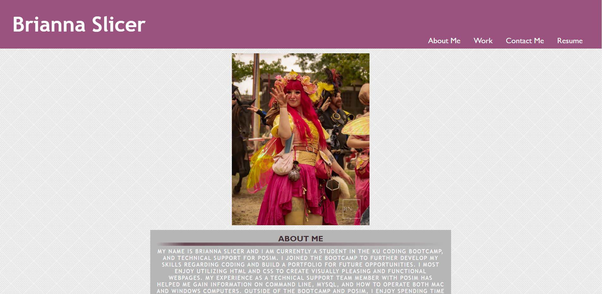
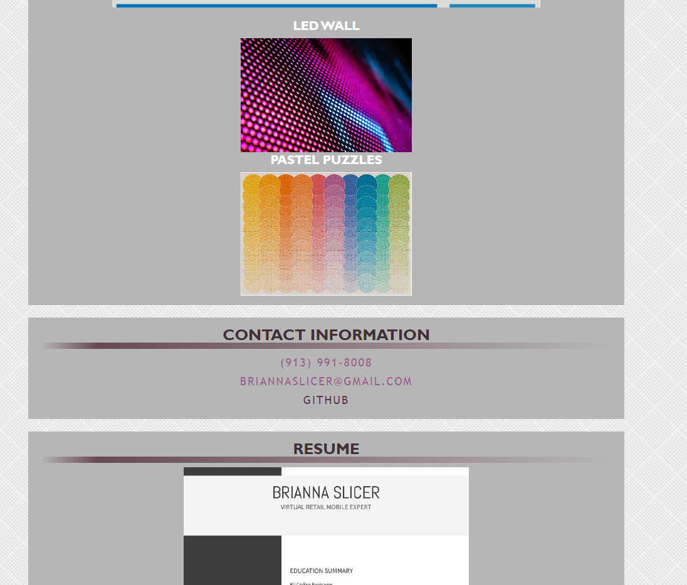

# First Portfolio

## Description

- My motivation for this project was to create a portfolio to use for potential employers and to showcase my work. It will continue to be improved upon as my skillset grows.
- I built this project to put my knowledge of both HTML and CSS together in a cohesive code and produce a functional deployed site.
- This code showcases information about me, methods of contact, showcases projects, and has a resume ready to view. This also displays my coding skills thus far, making it easier for potential employers to seek out.
- Composing this portfolio, I learned how to utilize content boxes to hold other aspect of the code, apply HTML and CSS semantics to create a cleaner, easier to read code, and create links to different portions of the webpage.

## Github & Deployed Site
- [Github](https://github.com/Celyph)
- [Deployed Site](https://celyph.github.io/portfolio-1/)

## Usage

## Credits

I used the ReadMe guide from [https://coding-boot-camp.github.io/full-stack/github/professional-readme-guide](https://coding-boot-camp.github.io/full-stack/github/professional-readme-guide).

Otherwise I used old code of my own to help piece this project together.